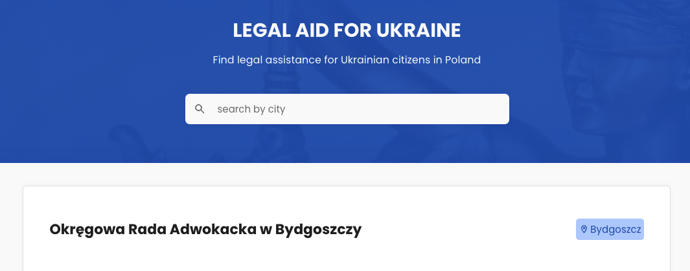

# Find legal assistance for Ukrainian citizens in Poland

## :technologist: Technologies and metodologies

Technologies and metodologies used in this project:

**React.js / CSS / BEM / RWD / Firebase**

Check live version: **[Live](https://rafalkazik.github.io/free-legal-aid/)**

## :gear: Installation

The project uses [node](https://nodejs.org/en/) and [npm](https://www.npmjs.com/). To run the app on your device you should install all dependencies. Then create a localhost port and run your web explorer.

Let's start with installing all dependencies. Move to the app main workspace and run:

    npm i

To create a localhost port you should type:

    npm start

Our repositories search engine is ready at port 3000.

    http://localhost:3000/

## :mag_right: Searcher

As part of this project, you can find organizations that provide free legal assistance to Ukrainian citizens in Poland.

The search engine reacts directly to the typed characters and shows the relevant cities.

A database with these organizations is created, updated and verified by me.
